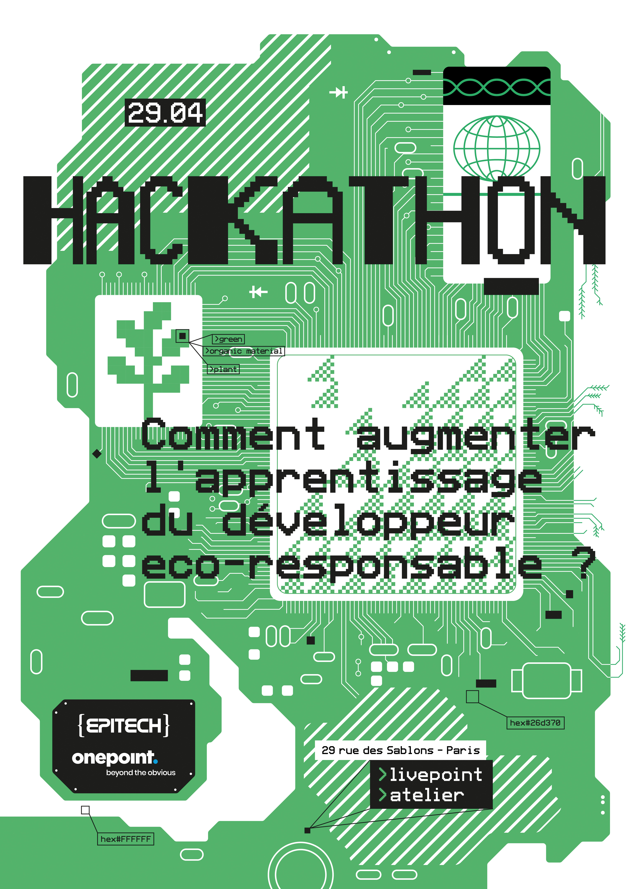

# 🌍 Hackathon Onepoint x Epitech : Développeur Éco-responsable

## 📚 Sommaire
1. [Introduction](#introduction)
2. [Contexte du développement durable](#contexte-du-développement-durable)
3. [Enjeux du numérique](#enjeux-du-numérique)
4. [Principes du numérique responsable](#principes-du-numérique-responsable)
5. [Enjeux de l’IA et optimisation](#enjeux-de-lia-et-optimisation)
6. [Pratiques Green IT](#pratiques-green-it)
7. [Objectifs et méthodologie du hackathon](#objectifs-et-méthodologie-du-hackathon)

---

## 🌟 Introduction
Ce projet a été initié lors du hackathon Onepoint x Epitech du 29/04.  
**Objectif : Comment augmenter l’apprentissage du développeur éco-responsable ?**

---

## 🌱 Contexte du développement durable
En 2015, l’ONU a mis en place **5 objectifs de développement durable**, dont plusieurs environnementaux.  
La **théorie des limites planétaires** (Université de Stockholm) montre que dépasser certains seuils entraîne un dérèglement global de la biosphère :
- Pollution importante des sols
- Déforestation et urbanisation croissantes
- Dérèglement du cycle de l’eau, accentuant les pénuries
- Augmentation probable du nombre de réfugiés climatiques

---

## 💻 Enjeux du numérique
- **34 milliards d’équipements numériques** pour 3 milliards d’utilisateurs, soit 15 équipements par utilisateur
- Environ **4,2% de la consommation d’énergie primaire mondiale**
- Environ **3,8% des émissions de gaz à effet de serre**
- Si le numérique était un pays, il serait **3 fois plus gros que la France**

La consommation d’énergie des data centers a explosé avec l’introduction des LLM, atteignant plusieurs milliers de TWh.  
Un **starter pack d’image générée par IA** peut consommer jusqu’à **4 litres d’eau**, aggravant la pénurie, notamment dans les zones arides.

---

## ♻️ Principes du numérique responsable
Le hackathon se concentre sur le **numérique responsable** :
- Application des principes de la **RSE** et du **développement durable** à toutes les phases d’un produit numérique (environnement, économie, social)
- Solutions **IT for Green**, **IA for impact** : innovations à faible impact environnemental
- **Éco-conception** intégrée dès le début de la conception produit

---

## 🤖 Enjeux de l’IA et optimisation
L’IA est un domaine énergivore ayant un fort impact environnemental.  
Approches pour optimiser son usage :
- **Choisir le LLM adapté** : inutile d’utiliser un grand modèle pour une tâche basique
- **Limiter le nombre de tokens générés** : moins d’entrées → moins de calculs → moins d’énergie consommée
- **Favoriser les IA moins énergivores** : Mistral, DeepSeek
- **Réfléchir à la nécessité de l’IA** : est-elle vraiment indispensable ?

---

## 🌿 Pratiques Green IT
Pour réduire l’impact du numérique, adoptons des pratiques Green IT :
- **Mise en cache des données** lorsque possible
- **Optimisation du code** pour limiter les calculs inutiles
- **Minimisation des requêtes et des réponses**
- Réduction de la consommation énergétique des serveurs, notamment pour le refroidissement (quantité d’eau utilisée massive)

---

## 🏆 Objectifs et méthodologie du hackathon
- 📐 **Formater la documentation** de façon lisible et cohérente (obligatoire)
- 💬 **Réponses courtes aux questions complexes**, renvoyant vers la documentation
- 🌐 Rediriger vers internet ou **letmegooglethat.com** pour les requêtes trop simples
- 🚫 Empêcher les questions hors sujet (non techniques)
- 🎯 **Indicateur de confiance (%)** dans les réponses fournies
- 🔄 Gestion des requêtes répétées avec renvoi vers l’historique
- 🤖 **Optimisation IA** : choisir le bon modèle, limiter les tokens, éviter les réponses verbeuses
